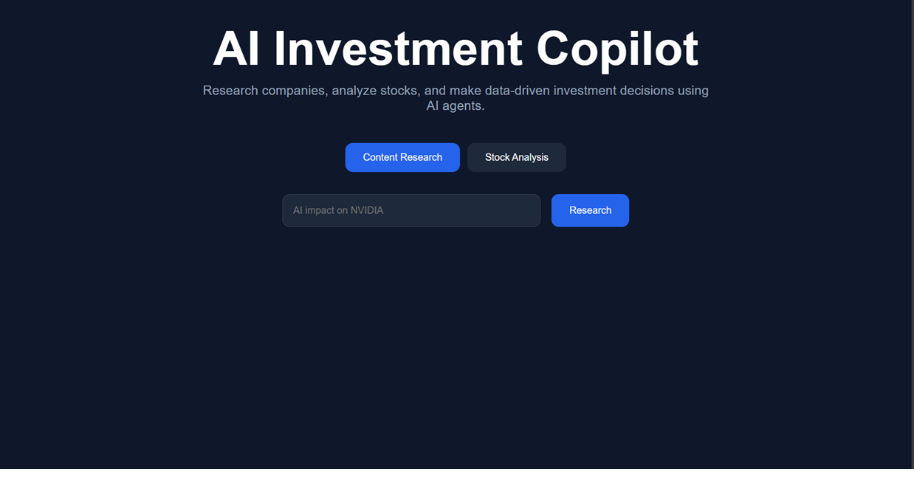

# 🤖 AI Investment Copilot



A full-stack AI-powered investment research platform built with **React + TypeScript** frontend and two independent **CrewAI + FastAPI** backends — one for content research and one for stock analysis.

---

## 🌐 Live Demo

| Service | URL |
|---|---|
| Frontend | [ai-crew (Render Static Site)](https://github.com/arvinth186/ai_crew) |
| Content Researcher API | [content-researcher-4jf9.onrender.com](https://content-researcher-4jf9.onrender.com) |
| Stock Analyst API | [stock-analyst-ii2t.onrender.com](https://stock-analyst-ii2t.onrender.com) |

---

## 🏗️ System Architecture

```
┌─────────────────────────────────────────┐
│         React + TypeScript Frontend      │
│              (Vite + Axios)              │
│                                         │
│   Tab 1: Content Research               │
│   Tab 2: Stock Analysis                 │
└──────────────┬──────────────────────────┘
               │
       ┌───────┴────────┐
       │                │
       ▼                ▼
┌─────────────┐  ┌─────────────────┐
│  Project 1  │  │    Project 2    │
│  Content    │  │  Stock Analyst  │
│  Researcher │  │    FastAPI      │
│  FastAPI    │  │   (deployed)    │
│  (deployed) │  │  POST /analyze  │
│  POST       │  └────────┬────────┘
│  /generate  │           │
└──────┬──────┘           │
       │                  │
       ▼                  ▼
┌─────────────┐  ┌─────────────────────────────┐
│  CrewAI     │  │  CrewAI Multi-Agent System  │
│  4 Agents   │  │  4 Agents                   │
│             │  │                             │
│ 1. Research │  │ 1. News Researcher          │
│ 2. Fact     │  │ 2. Financial Analyst        │
│    Check    │  │ 3. Risk Assessment          │
│ 3. Writer   │  │ 4. Report Writer            │
│ 4. Editor   │  └──────────────┬──────────────┘
└──────┬──────┘                 │
       │                        │
       ▼                        ▼
┌─────────────┐  ┌─────────────────┐
│Serper Search│  │  Serper Search  │
│    Tool     │  │  + YFinance     │
└─────────────┘  └─────────────────┘
       │                        │
       ▼                        ▼
  Markdown Article        Investment Report
  (600–800 words)         (with recommendation)
```

---

## 📦 Repositories

| Repo | Description |
|---|---|
| [ai_crew](https://github.com/arvinth186/ai_crew) | React + TypeScript frontend |
| [content_researcher](https://github.com/arvinth186/content_researcher) | Content Research CrewAI + FastAPI |
| [stock_analyst](https://github.com/arvinth186/stock_analyst) | Stock Analysis CrewAI + FastAPI |

---

## ✨ Features

- **Content Research Tab** — enter any topic and get a fully researched, fact-checked, and edited markdown article generated by 4 AI agents working in sequence
- **Stock Analysis Tab** — enter a company name and ticker to get a comprehensive investment brief with financial data, news sentiment, risk assessment, and a buy/hold/sell recommendation
- Copy report to clipboard or download as PDF directly from the UI
- Both backends deployed independently on Render with auto-deploy from GitHub

---

## 🤖 Agent Pipelines

### Content Researcher — Sequential Pipeline

```
User Topic
    │
    ▼
Research Agent ──(Serper Search)──► Gathers facts from 2–3 sources
    │
    ▼
Fact Checker ───(Serper Search)──► Verifies & flags unverified claims
    │
    ▼
Writer Agent ───────────────────► Writes 600–800 word markdown article
    │
    ▼
Editor Agent ───────────────────► Polishes to publication quality
    │
    ▼
Final Article (Markdown)
```

### Stock Analyst — Sequential Pipeline

```
Company + Ticker
    │
    ▼
News Researcher ─(Serper Search)──► Latest news, earnings, sentiment
    │
    ▼
Financial Analyst ──(YFinance)───► Price, PE ratio, market cap, volume
    │
    ▼
Risk Assessment Agent ───────────► Market, company & macro risks
    │
    ▼
Report Writer ───────────────────► Executive summary + recommendation
    │
    ▼
Investment Brief (Markdown)
```

---

## 🛠️ Tech Stack

| Layer | Technology |
|---|---|
| Frontend | React, TypeScript, Vite, Axios |
| Backend | FastAPI, Python |
| AI Framework | CrewAI |
| LLM | Groq (llama-3.3-70b-versatile) |
| Search | Serper Dev API |
| Financial Data | YFinance |
| Deployment | Render (Static Site + Web Services) |

---

## 🚀 Local Development

### Prerequisites

- Node.js 18+
- Python 3.10–3.13

### Frontend Setup

```bash
git clone https://github.com/arvinth186/ai_crew.git
cd ai_crew
npm install
npm run dev
```

Frontend runs at `http://localhost:5173`

### Content Researcher API Setup

```bash
git clone https://github.com/arvinth186/content_researcher.git
cd content_researcher
pip install -r requirements.txt
```

Create `.env`:
```
GROQ_API_KEY=your_groq_api_key
SERPER_API_KEY=your_serper_api_key
MODEL=groq/llama-3.3-70b-versatile
```

```bash
uvicorn src.content_researcher.api.main:app --reload --port 8000
```

### Stock Analyst API Setup

```bash
git clone https://github.com/arvinth186/stock_analyst.git
cd stock_analyst
pip install -r requirements.txt
```

Create `.env`:
```
GROQ_API_KEY=your_groq_api_key
SERPER_API_KEY=your_serper_api_key
MODEL=groq/llama-3.3-70b-versatile
```

```bash
uvicorn api.main:app --reload --port 8001
```

---

## 📡 API Reference

### Content Researcher

**POST** `https://content-researcher-4jf9.onrender.com/generate`

```json
// Request
{ "topic": "AI impact on NVIDIA" }

// Response
{
  "topic": "AI impact on NVIDIA",
  "article": "# AI Impact on NVIDIA\n\n..."
}
```

### Stock Analyst

**POST** `https://stock-analyst-ii2t.onrender.com/analyze`

```json
// Request
{ "company": "Apple", "ticker": "AAPL" }

// Response
{
  "success": true,
  "company": "Apple",
  "ticker": "AAPL",
  "report": "# Apple Investment Brief\n\n..."
}
```

---

## 🌐 Deployment on Render

### Backend APIs (Web Service)

- **Build Command:** `pip install -r requirements.txt`
- **Start Command:** `uvicorn api.main:app --host 0.0.0.0 --port $PORT`
- **Environment Variables:** `GROQ_API_KEY`, `SERPER_API_KEY`, `MODEL`

### Frontend (Static Site)

- **Build Command:** `npm install && npm run build`
- **Publish Directory:** `dist`

---

## ⚠️ Disclaimer

This project is for educational and research purposes only. Generated reports do not constitute financial advice. Always conduct your own due diligence before making investment decisions.

---

## 👨‍💻 Author

**Arvinth** — [github.com/arvinth186](https://github.com/arvinth186)
